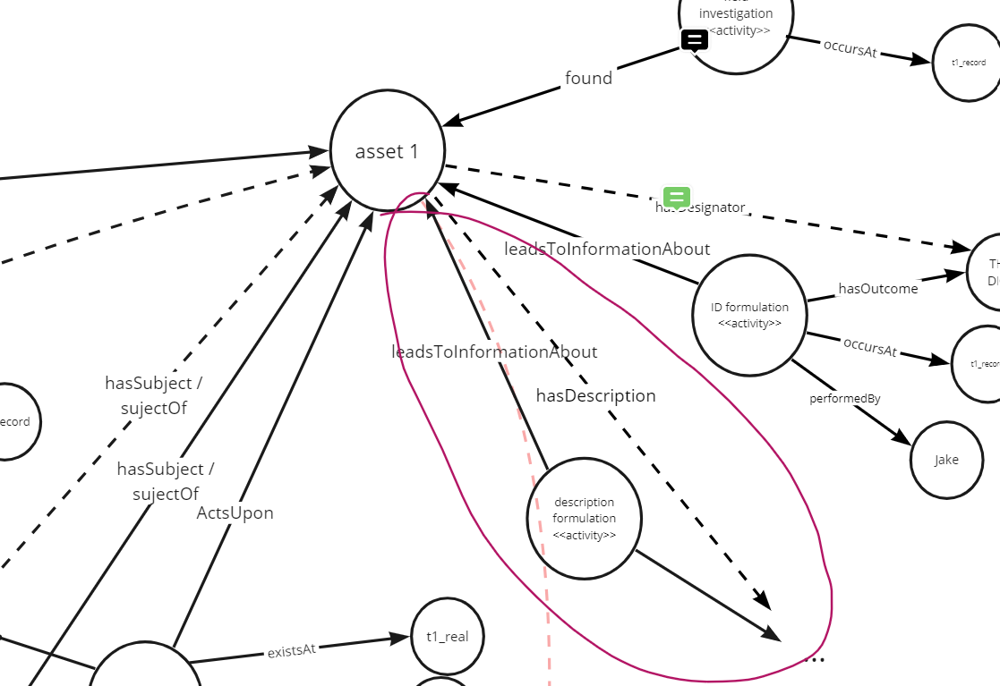

- ## [[🧠to keep in mind]]: plan for vendor selection AND continued development
  id:: 64bfe310-31c6-4a55-b9db-bf7cf333c6b4
  initiative:: #initiative/datahub/planning 
  keep-until-date:: [[Aug 31st, 2023]]
  embedded-in-mind:: no
	- Our plan is to test to find the most viable vendor's solution that can satisfy our speed requirements
	- Among the vendors that satisfy the speed requirement, we will select the most competent vendor that seem to have the most comprehensive feature set, and migrate our development to its solution.
	- Our goal is to know which solution is the best for us, before the RFP is out on the street.
- ## [[👩🏻‍⚖️decision]] on properties should / could be captured against the DH entity
  id:: 848f0fd6-7ed9-462f-afc8-e6aca45302b7
  initiative:: #initiative/datahub/modeling
  tentative:: yes
  still-relevant:: yes
  tags:: #[[💡insight]] 
  review-on-date:: [[Aug 4th, 2023]]
	- This decision is an extension of the previous decision
		- {{embed ((64c185f6-b54d-44b4-ada3-bc43f7ed00d9))}}
	- DH may keep an authoritative version of a property, if
		- 1) this property is being track in multiple data systems
		- 2) this property is permanent for the entity and does not change for as long as the entity exists.
	- {:height 356, :width 475}
	- Examples of such properties include:
		- entity number
		- role parent, space parent, etc.
	- The insight: the implication of this is that if one of these properties change, not due to a correction but an update (say for example a group moved under to another department), then the entity before the change ceases to exist and a new entity is created. (The group after the move is a different group.)