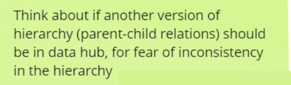

- ## [[🧠to keep in mind]]: switching to a likely vendor(s) for further dev
  id:: 64bfe310-31c6-4a55-b9db-bf7cf333c6b4
  initiative::
  keep-until-date:: [[Aug 31st, 2023]]
  embedded-in-mind:: no
	- Our plan is to test to find the most viable vendor's solution, then migrate our continuing work into that solution
	- Our goal is to know which solution is the best for us, before the RFP is out on the street
- ## [[👩🏻‍⚖️decision]] on which properties should be captured against the DH entity
  id:: 848f0fd6-7ed9-462f-afc8-e6aca45302b7
  initiative:: #initiative/datahub/modeling
  tentative:: yes
  still-relevant:: yes
  tags::
	- DH should keep an authoritative version of a property, if 1) this property is being track in multiple data systems 2) this property is permanent and does not change, and we expect all systems to have the same value at all times. #💡insight
	- This means that it is likely that only entity number needs to be tracked as a property directly against the DH entity.
		- {:height 356, :width 475}
	- To answer the question
		- {:height 132, :width 379}
		- The answer is no, correction to the hierarchy parent, like corrections to other properties, should be captured as a new manifestation (but asserted by the datahub entity)