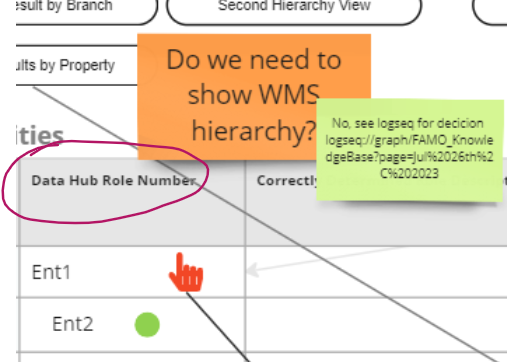
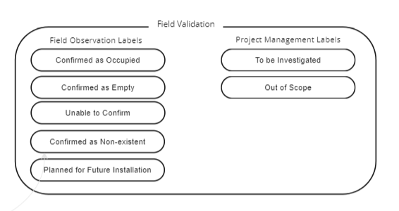
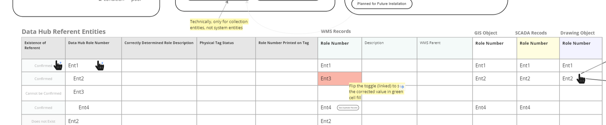

- ## [[👩🏻‍⚖️decision]]: do we need to show the WMS hierarchy in the Reconciliation App?
  initiative:: #initiative/datahub/UI
  tentative:: yes
  still-relevant:: yes
  id:: 64c1261c-5ea3-49f7-992c-5c4ebead9610
	- No
	- The data reconciler is going to use engineering drawings as his reference, not the original hierarchy
	- You can also easily see the hierarchy in the WMS
	- 
-
- ## [[👩🏻‍⚖️decision]]: should we have separate views for "Hub Builder" and "Field Validation"?
  initiative:: #initiative/datahub/UI 
  tentative:: yes
  still-relevant:: yes
	- No
	-
	- In both the Hub Builder and the Field Validation views, you will need the ability to edit the hierarchy
		- in Hub Builder, as you are determining the ID of an entity and find that it is under the wrong parent, you would want to be able to change it
		- in Field Validation phase, if you discover a missing entity or an entire missing train, you would want to add it to the hierarchy
	- In both views you will need the ability to edit entity property values.  Many property values, such as space of role, are not confirmed only during field validation.  They can be confirmed while you are working on linking records and fixing hierarchy (previously envision Hub Builder functionalities). It will be a real hassle to switch to the Field Validation interface to make those changes.
	- This leaves only the following set of actions applicable exclusive to Field Validation view.  In my opinion it is better to combine the two view and avoid the narrative confusion.
		- 
		-
- ## [[🧠to keep in mind]] about the use of GraphQL
  initiative:: #initiative/datahub/controller 
  keep-until-date::
  embedded-in-mind:: no
	- #GraphQL may helps with the performance of loading to this table, when we are only choosing a few columns to load and hiding all of the rest. This could help us with performance. But if we are doing lazy loading, this may not be a big deal.
		- 