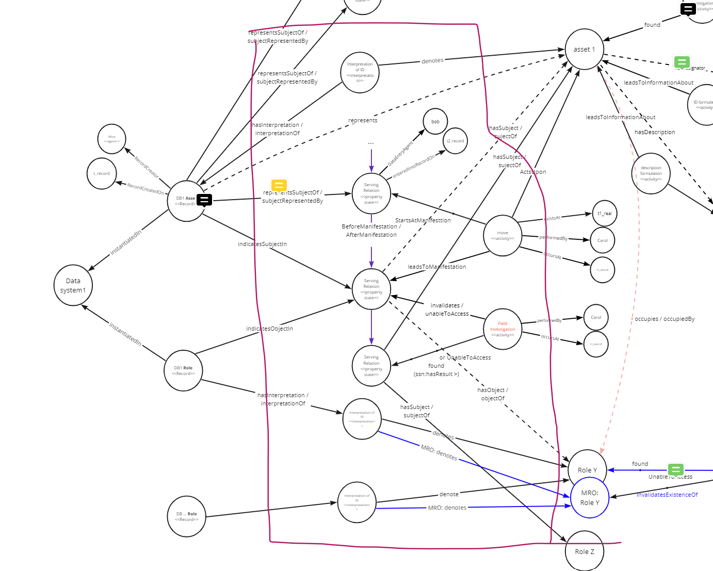

- #[[💡insight]] on capital project and entity records
	- The capital projects involve signing out existing set of records from a repository (e.g. drawing, WMS) modifying them, and then replacing them.  This is different from creating new records in a new data source.  This is to say that a set of drawing page signed out by the consultant for editing, or the AIW issued to a project are not its own data source.
- [[💡insight]] on both property manifestation and the work (field work or reconciliation) are process/activity entities.
	- This is if we interpret property manifestation as a stasis - a process in which nothing happens
	- This means that the central region of our model could be known as the "process region"
		- {:height 411, :width 419}
- #[[💡insight]] on why we need to represent records
	- 1) handle incremental record ID changes and allow association of records that have different IDs - if we don't have records then we can't cluster records bearing different IDs around the same DH referent entity.  And if we cannot do that, if we must ensure that all records from all systems that represent the same thing must have the same ID at all times.
	- 2) in the same system, there could be duplicate records each containing partial history. (This may not occur that frequently.)
- ### [[👩🏻‍⚖️decision]] to NOT map the historical information from data sources into the data hub in 2023
  initiative:: #initiative/datahub/planning 
  tentative:: yes
  still-relevant:: yes
  review-on-date::
	- Background:
		- Certain property's historical values are kept in the database.  Common term used to refer to this information is audit history of the property.
		- This audit history can technically be mapped into a manifestation chain.
	- Decision:
		- This can be considered as more of a "data hub configuration" issue.
		- We have a lot to do for this year, and will leave this one out.
-