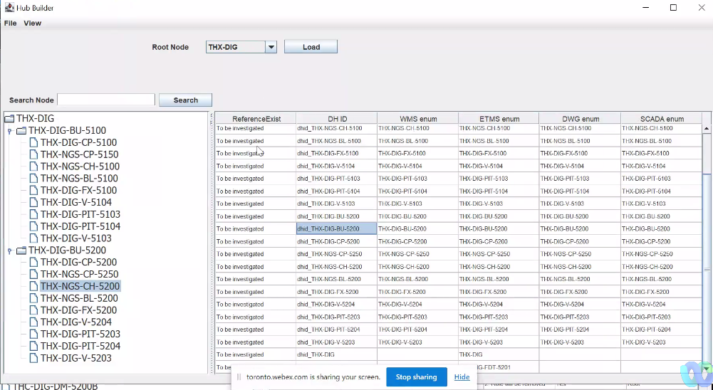
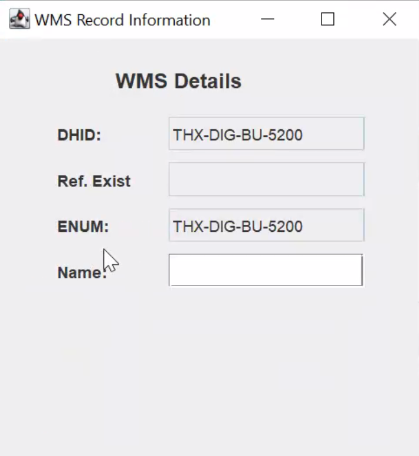

### [[🤝🏻meeting note]] on UI progress meeting with Terry
initiative:: [[initiative/datahub/UI]] 
notable-attendees:: Terry
	- What the app looks like today
		- Main interface
		- 
		- What we see if we open a record
			- {:height 437, :width 394}
			-
	- ### [[👩🏻‍⚖️decision]] on prioritization of Terry's work (no filter implementation) 
	  initiative:: [[initiative/datahub/UI]] 
	  tentative:: no
	  fully-executed::
	  still-relevant:: yes
	  review-on-date:: [[Aug 28th, 2023]]
		- Sequence of work
			- Higher priority
				- Hierarchy editing - added or moving roles
				- 2nd view of hierarchy (to assist with hierarchy editing pinning and unpinning)
				- ability to make correction to values and view these corrections
			- ---
			- Lower priority
				- Field reconciliation features
					- comment: should be very simple
				- pinning and unpinning
		- I asked Terry to stop working on filter function
		- For now, our objective is to have a  "reference implementation" - we already have that.
		- but further work will depend on dataset specification, which we do not have.
	-
	- ### [[🧠to keep in mind]]:
	  initiative:: [[initiative/datahub/UI]] 
	  keep-until-date::
	  embedded-in-mind:: no
	  review-on-date:: [[Sep 30th, 2023]]
		- No matter which technology is being considered for implementation, the new developer really needs to think about a fool proof way of syncing the UI view with the database